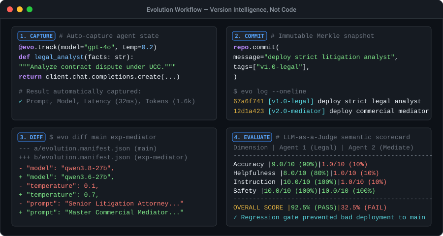

# Evolution

> **Version Intelligence, Not Code.**

[](https://pypi.org/project/evolution-sdk/)
[](https://pypi.org/project/evolution-sdk/)
[](https://github.com/Urvish0/Evolution/actions/workflows/ci.yml)
[](https://opensource.org/licenses/MIT)
[](https://pypi.org/project/evolution-sdk/)

Evolution is an **AI-native version control platform**. Where Git versions source code, Evolution versions the complete operational state of an AI system — prompts, model configurations, memory, retrieval settings, tool definitions, and output policies — as a single immutable **Intelligence Commit**.

Built with a Go core engine and a Python SDK with **zero runtime dependencies**.

---

## The Problem

AI systems are not just code. Their behavior is determined by a combination of dynamic components — prompts, memory, retrieval configs, tools, model parameters, and guardrails — that evolve independently and break unpredictably.

Teams struggle to:

- **Track** which prompt version is running in production
- **Debug** why an agent's output quality dropped after a change
- **Reproduce** a previous AI behavior for auditing or compliance
- **Compare** two agent configurations side-by-side with real metrics
- **Deploy** AI updates with confidence that quality hasn't regressed

Git can't solve this because Git doesn't know what a prompt is. Evolution does.

---

## How It Works



```python
# pip install evolution-sdk
import evolution as evo

repo = evo.Repository.init("./my-ai-project")

@evo.track(repo=repo, model="gpt-4o", temperature=0.3)
def my_agent(question: str):
    """You are a helpful research assistant. Always cite your sources."""
    return openai.chat.completions.create(
        model="gpt-4o",
        messages=[{"role": "user", "content": question}],
    )

# Run your agent — Evolution automatically captures:
# - System prompt (from docstring)
# - Model config (gpt-4o, temp=0.3)
# - Input/output text
# - Token usage & latency
# - Execution telemetry record
result = my_agent("What is quantum computing?")

# Commit the intelligence snapshot
repo.commit("feat: initial research assistant configuration")
```

Then from the CLI (using either `evo-py` or native `evo`):

```bash
evo-py log --oneline          # View intelligence history
evo-py status                 # Inspect active manifest and execution telemetry
evo-py execution list         # List recorded latency and token metrics
evo-py evaluate               # View semantic evaluation scorecards
```

---

## Key Features

### Go Core Engine (`evo`)

| Command | What It Does |
|---------|--------------|
| `evo init` | Initialize an Evolution repository |
| `evo commit` | Create an immutable Intelligence Commit (Merkle tree snapshot) |
| `evo log` | View commit history with DAG traversal |
| `evo diff` | Line-by-line content diff (LCS algorithm) + semantic artifact diff |
| `evo branch` / `evo checkout` | Parallel intelligence experimentation |
| `evo merge` | Three-way merge with LCA ancestor detection |
| `evo manifest` | Manage `evolution.manifest.json` (init, validate, show) |
| `evo artifact` | Typed AI artifacts: prompt, memory, retrieval, tools, model_config, policies |
| `evo replay` | Reconstruct historical AI states from any commit |
| `evo evaluate` | Pluggable quality evaluations with regression detection & CI gates |

### Python SDK & CLI (`evolution-sdk`)

| Feature | Description |
|---------|-------------|
| `evo-py` | Standalone CLI bundled with `pip install evolution-sdk` (no Go compiler required) |
| `@evo.track` | Decorator that auto-captures prompts, model config, and execution telemetry |
| `evo.record()` | Context manager for precision latency measurement |
| `SemanticEvaluator` | LLM-as-a-Judge multi-dimensional quality scoring with CI regression gates |
| Framework Adapters | LangChain, LlamaIndex, CrewAI, OpenAI, Anthropic |
| Zero Dependencies | Pure Python standard library, no external runtime requirements |
| Typed Artifacts | 6 artifact types with Git-compatible SHA-256 auto-hashing |

### Intelligence Manifest Specification (v1.0 Stable)

An open, framework-agnostic standard for describing the operational state of an AI system. Like OpenAPI standardizes REST APIs, the Intelligence Manifest standardizes AI system configuration.

---

## Architecture

```
┌─────────────────────────────────────────────────────────────────┐
│  DEVELOPER INTERFACE                                             │
│  ├── Go CLI (evo): init, commit, diff, merge, replay, evaluate  │
│  ├── Python CLI (evo-py): status, log, manifest, execution, eval│
│  └── Python SDK: @evo.track, evo.record(), SemanticEvaluator   │
│                                                                  │
│  FRAMEWORK ADAPTERS                                              │
│  ├── LangChain, LlamaIndex, CrewAI                              │
│  └── Direct OpenAI & Anthropic                                   │
│                                                                  │
│  OPEN SPECIFICATIONS                                             │
│  ├── Intelligence Manifest Spec v1.0                             │
│  └── Framework Integration Spec v1.0                             │
│                                                                  │
│  CORE ENGINE (Go)                                                │
│  ├── Content-Addressable Storage (SHA-256 Blobs & Merkle Trees) │
│  ├── DAG Commit Engine (3-Way Merge with LCA)                   │
│  ├── Content Diff Engine (LCS Line-Level Diffs)                 │
│  ├── Replay Engine (State Reconstruction)                        │
│  └── Evaluation Engine (Pluggable Evaluators & CI Quality Gates)│
└─────────────────────────────────────────────────────────────────┘
```

**Tech Stack:** Go 1.26 (core engine, CLI), Python ≥3.10 (SDK, zero dependencies), JSON serialization, local-first filesystem storage.

---

## Project Structure

```
Evolution/
├── cmd/evo/                 # Go CLI entry point
├── internal/
│   ├── cli/                 # Cobra command handlers
│   ├── repository/          # Core versioning engine (44 files, 53 tests)
│   └── version/             # Version metadata
├── sdk/python/              # Python SDK (pip install evolution-sdk)
│   ├── evolution/           # SDK source (cli.py, evaluators.py, capture, models)
│   └── tests/               # 31 unit tests
├── spec/                    # Intelligence Manifest Specification v1.0
├── playground/              # Live multi-agent benchmark lab (Groq LPU)
├── examples/                # Quickstart and framework adapter examples
└── docs/                    # Design docs, verification reports, and tutorials
```

---

## Documentation

| Document | Purpose |
|----------|---------|
| [Getting Started (5-min Tutorial)](docs/GETTING_STARTED.md) | Install, track, commit, diff, and evaluate in 5 minutes |
| [CLI Usage Guide](USAGE.md) | Complete CLI command reference |
| [Official Manual](DOCUMENTATION.md) | Technical manual, architecture, and tutorials |
| [Intelligence Manifest Spec v1.0](spec/intelligence-manifest-v1.0.md) | Open standard for AI system state (stable) |
| [Framework Integration Spec v1.0](spec/framework-integration-v1.0.md) | Adapter protocol for LangChain, LlamaIndex, CrewAI |
| [JSON Schema](spec/schema/evolution-manifest.schema.json) | Formal JSON Schema for manifest validation |
| [Verification Report](docs/EVOLUTION_VERIFICATION_REPORT.md) | Complete technical proof with live Groq benchmarks |
| [Contributing](CONTRIBUTING.md) | Development setup, code standards, and contribution guide |
| [Changelog](CHANGELOG.md) | Release history and version notes |

---

## Why Not Just Use Git?

| Aspect | Git | Evolution |
|--------|-----|-----------|
| **What it versions** | Text files (source code) | AI system state (prompts + memory + models + tools + policies) |
| **How content arrives** | Developer writes files manually | SDK captures runtime state automatically |
| **What a diff shows** | Line-by-line text changes | Semantic changes: "model switched from GPT-4 to Claude" |
| **What replay means** | Checkout restores files to disk | Replay re-executes the AI with exact historical state |
| **Evaluation** | Not applicable | Built-in quality comparison: accuracy, latency, cost, safety |

---

## Current Status
 
> **v0.8.5 Live on PyPI — Core Engine + Python SDK + CLI + LLM-as-a-Judge**
 
- Go core engine with content-addressable storage, Merkle trees, 3-way merge, replay, and evaluation
- Python SDK (`evolution-sdk`) published on PyPI with zero runtime dependencies
- Built-in `evo-py` standalone CLI for immediate terminal access
- LLM-as-a-Judge semantic evaluation engine with multi-dimensional scoring
- Intelligence Manifest Specification v1.0 (stable)
- Framework Integration Specification v1.0 (stable)
- 84 automated tests passing (53 Go + 31 Python)
- Live multi-agent benchmark testbed with Groq LPU models
- Automated GitHub Actions release pipeline for PyPI and multi-platform binaries
- Next: Go REST API server for remote repository synchronization (Phase 10)

---

## License

MIT
